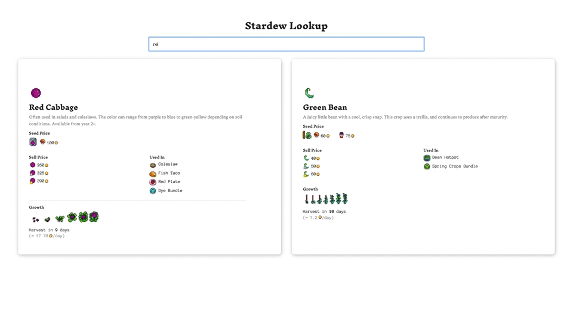

# [Stardew Lookup](https://stardew-lookup.netlify.com/)

Stardew Lookup is a crop reference tool for the game [Stardew Valley](https://www.stardewvalley.net/).

---
### Purpose
Have a quick reference for crop prices and harvest information.

### Goal 
Create a tool that provides the most essential information. The official [wiki](https://stardewvalleywiki.com/Stardew_Valley_Wiki) is extremely informative but may be slow to load and/or overwhelming in its completeness.

### Stack
Stardew Lookup is built with React, Airtable API, and Styled Components and hosted on Netlify. 
